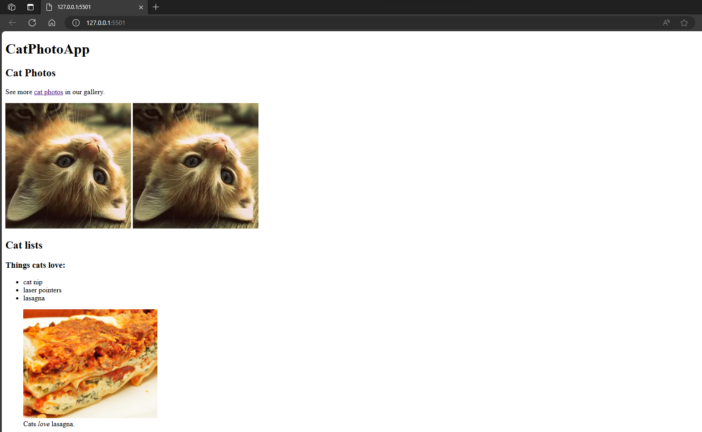
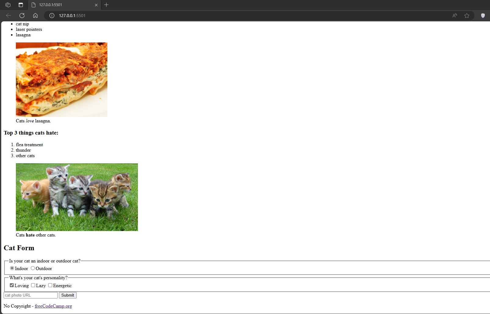
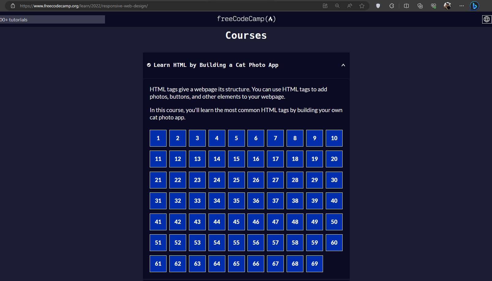

# Cat Photo App
The purpose of this repo is to monitor my progress in learning HTML by making a basic CatPhotoApp. I am utilizing the freeCodeCamp "Learn HTML by Building a Cat Photo App" for this repo.

## Screenshots

## Learnings
1. Learned the basic structure of an HTML document.
2. Learned how to create a form element.
3. I've also realized that the website could be ugly at first but it will be improved as I learn more about CSS.

